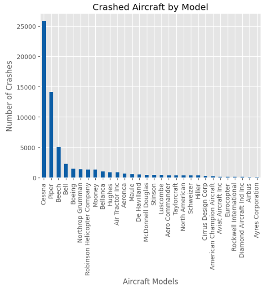

# NTSB Aviation Analysis

Author: [Nesphory Mwakale](nrmmwakale07@gmail.com)

# Project Overview
This project analyzes the NTSB Aviation Accident dataset, which contains aviation accidents from 1962 to 2023. It contains over 80,000 records. This analysis can be used to see the safest airlines with the least accidents, fatalities, and areas that can be improved to reduce such calamities.

# Business Problem
Sky High Corp is interested in purchasing and operating airplanes for commercial and private use. They, however, do not know anything about the potential risks of aviation. We have been tasked with determining which aircraft are the lowest risk for the company to start this new business endeavor.

# Data Understanding
In the data folder is a dataset [AviationData](https://www.kaggle.com/datasets/khsamaha/aviation-accident-database-synopses) from the National Transportation Safety Board (NTSB), which includes aviation accident data from 1962 to 2023 about civil aviation accidents and selected incidents in the United States and international waters.

# Methods
This project uses descriptive analytics using Python's Pandas and visualization library to get insights.

# Insights
The Cessna is the most crashed airplane. From the 20 above, it appears in half of the occurrences.
The Cessna 172 and its variants have crashed the most. Specifically, the 172, 172N, 172M, and 172P models.
Piper models are also in this list, but 10% less than Cessna.

Cessna seems to be the most preferred airplane model.

Airplane crashes have been on a continuous decline since 1982, showing that planes have become safer as more technology advances and more aviation laws have been passed. 

Planes have thus become safer.

Similar to airplane crashes, casualties as a result of plane crashes have also declined since 1982 due to advancements in technology and aviation laws, which have made air travel safer.

There has always been a higher number of survivors than casualties over the years. There has been a recorded decline in both survivors and casualties as the accidents have also become fewer.

Most airplane crashes are usually non-fatal. Non-fatal accidents are accidents that do not lead to fatalities.

Out of the top 20, Piper planes constitute 45% of the planes, and Cessna constitutes 40%. It can be argued that both of these aircraft manufacturers are the safest since they have the highest survival rate.

# Conclusions
- Airplane crashes and aviation casualties have become rarer and rarer with each passing year as technology keeps advancing and better aviation laws get passed. 
- Most accidents that do occur do not lead to loss of life but do have a great impact on the aircraft's lifespan and structural integrity.
- Most crashes involve aircraft from Cessna and Piper Aircraft. However, they seem to be the most preferred when it comes to personal aircraft. Specifically, the Cessna 172 and the Piper PA-28 lineups of aircraft.

# Business Recommendations
* As a starting business venture, it is recommended to start with aircraft with proven track records. Cessnas have been seen as the market leader, from small commercial trips to personal aircraft with the Cessna Citation and the Cessna 172 lineups of aircraft, respectively.
* The Cessna 172 and Piper PA-28 aircraft have been shown to lead the pack when it comes to personal use aircraft. Both have a wide variety of models that have been improving technologically to offer safety and peace of mind. The latest models for both are the Cessna 172 Skyhawk and Piper PA-28 Cherokee.
* It should also be noted that, according to [NASA](https://ntrs.nasa.gov/api/citations/20190001065/downloads/20190001065.pdf) and [Husain Law](https://hlalawfirm.com/8-aviation-accidents-caused-by-human-factors/), almost 80% of aviation accidents are caused by pilot error and not mechanical error. Therefore, Sky High Corp should greatly focus on hiring pilots with great track records and keep them trained and satisfied to reduce the risk of pilot error

# For More Information
See the full analysis in this [Jupyter Notebook](./aviation_accidents.ipynb) or this [presentation](./presentation.pdf).
